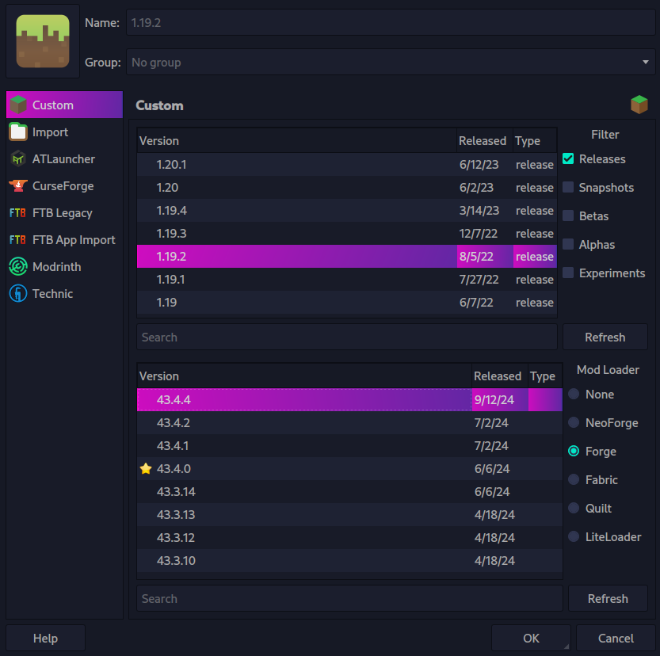
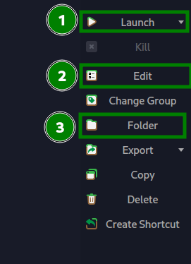
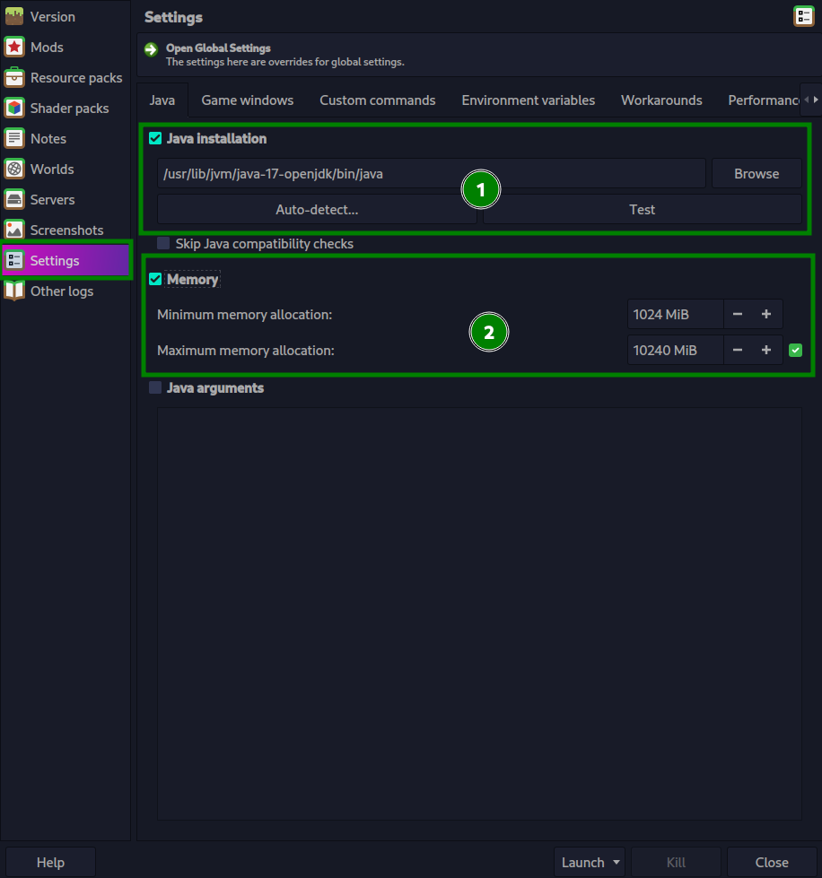
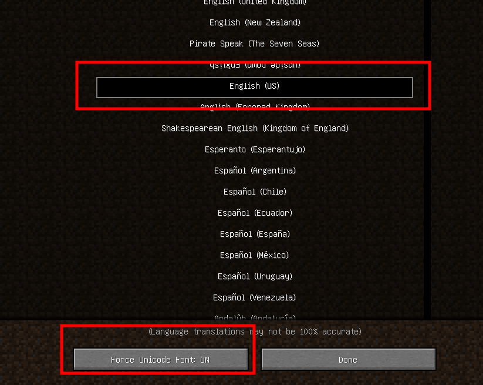
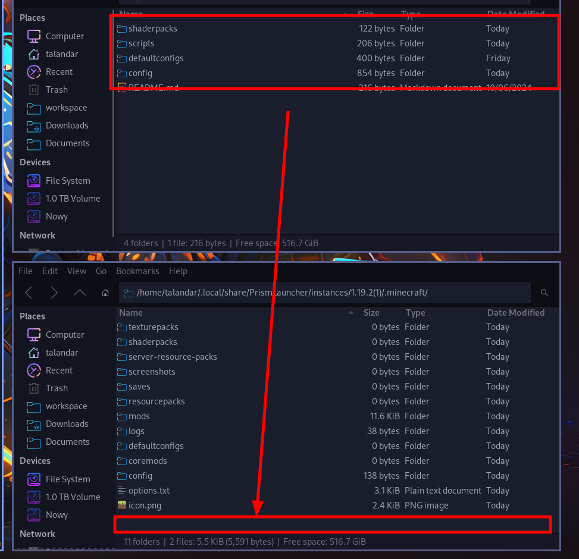

# Preparation 
## Creating account
Create account by clicking button in upper-right corner in PrismLauncher
### For non peremium launcher
`button`-> `Manage Accounts...` -> `Add Offline`
### For premium launcher
`button`-> `Manage Accounts...` -> `Add Microsoft`
## Creating instance
Create instance by pressing button `Add Instance` in upper-left corner in PrismLauncher
### After pressing Add Instance button
- click `Custom` on left panel 
- pick version `1.19.2` on upper half of PrismLauncher window
- pick `Forge` on bottom right panel
- pick version `43.4.4` on lower half of PrismLauncher window
final result should look like this: 

# Before launching
- 1. This button will launch your game
- 2. This button will allow to edit instance
- 3. This button will open your game instance files



## Instance settings
- open instance settings 
- press `settings` button
- check if you are using java version 17
- check and (optionally) change max allowed RAM

## First launch
- run game for the first time to check if everything till this point works
### checking game language and font 
- you can change language and font on right corner and main menu
- set it to be something like this

## File installation
- quit game and press `Foler` button in right panel to open instance files
### File installation (Where to put what?)
Put all files in correct folders. \
**REMOVE mods folder if it'n not empty** \
**In case of shaderpacks,scripts,defaultconfigs, and config just throw all at one into .minecraft** \
- mods                                  ===> .minecraft/mods
- custom_configuration/shaderpacks      ===> .minecraft/shaderpacks   
- custom_configuration/scripts          ===> .minecraft/scripts       
- custom_configuration/defaultconfigs   ===> .minecraft/defaultconfigs
- custom_configuration/config           ===> .minecraft/config        

if asked to replace files, replace them



#### Disable tutorial (optionally) 
- open `options.txt`
- find a line 
```
tutorialStep:movement
```
- change to
```
tutorialStep:none
```
- save
# About modpack
## Basics
### Thirst 
On right side of your life indicator you should be able to see Thirst indicator
Thirst is new mechanic added in modpack. You have to drink fluids in order to stay alife
The easiest way to deal with it in early game should be clay bowl. You can smelt it on campfire.
Remember also to boil/purify water. Drinking dirty water is not healthy
### Temperature
Temperature is new mechanic added in modpack.
You Can see temperature icon between health and hunger bar.
If icon is freezing, it means you are freezing.
If icon is burning, it means you are overheating.
Try to maintain grey icon color.
Temperature is dependant on:
- Day/Night cycle
- Biome
- Season
- Dimension 
If you feel to uncomfortable because of temperature you won't fall asleep.
Night, or winter can be realy cold.
Craft campfire. 
### Tools
Vanilla tool crafting is disabled. Use Tinkers Construct.
It is mod that add new way of creating weapons, tools and armors.
You should start a game with book called Materials And You.
Everything you need to know in order to create a basic tool is in this book.
### Spice of life (Potato and carrot edition)
#### Carrot Edtion
- You start game with one heart
- eat new things in order to gain more health
- you can earn up to 19 hearts this way. 
#### Potato Edition
- You start game with 3 debuffs
- eat different things in order to remove debuffs and gain buffs
- you can gain up to 3 buffs if last 64 foods were unique

